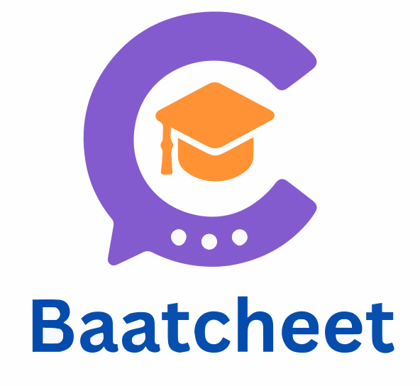
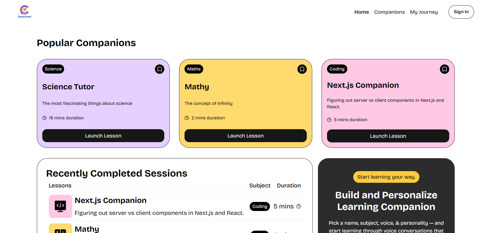
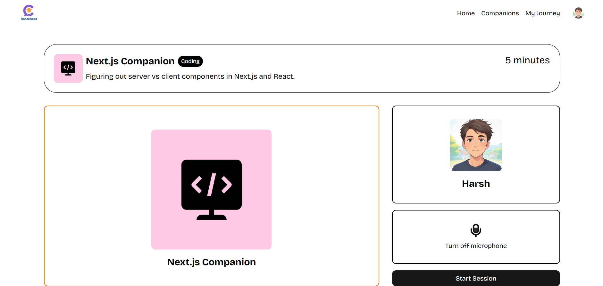

# Baatcheet - Your Personal AI Learning Companion 🤖

<!--   -->
<!-- Replace with a good screenshot or GIF of your app -->

**Live Demo:** [Deployed Link](https://baatcheet-dusky.vercel.app/) <!-- Replace with your live app link -->

**Baatcheet** is a full-stack, production-ready Software-as-a-Service (SaaS) platform that revolutionizes learning by providing users with personalized, voice-driven AI tutors. Engage in natural, real-time conversations on any topic, from coding with a virtual expert to exploring economics with a cheese capitalist.

This project was built to demonstrate modern web development practices, integrating cutting-edge technologies to create a scalable, interactive, and monetizable application.

## 🖼️ Screenshots

| Home Page                                    | Companion Session                                    |
| -------------------------------------------- | ---------------------------------------------------- |
|  |  |

---

## ✨ Key Features

-   **🎙️ Real-Time Voice Conversations:** Engage in smooth, interactive learning sessions with AI companions powered by **GPT-4** through the **Vapi** voice AI platform.
-   **🔒 Secure Authentication:** A complete and intuitive authentication system with email and Google providers, handled by **Clerk**.
-   **💳 Multi-Tiered Subscriptions:** A flexible subscription system with different plans, feature-gating, and seamless payment processing powered by **Clerk Billing** and **Stripe**.
-   **📚 Companion Library:** Discover and interact with a library of AI companions created by you and other users.
-   **🔍 Dynamic Search & Filtering:** Easily find the perfect learning companion by searching and filtering by subject or topic.
-   **📈 Session & Progress Tracking:** Keep track of your learning journey with a detailed session history and progress dashboard.
-   **🎨 Modern & Responsive UI:** A familiar yet custom user experience built with **Next.js**, **Tailwind CSS**, and **Shadcn/UI**, ensuring a seamless experience on all devices.
-   **🚀 Production-Ready & Scalable:** Built on a robust and scalable architecture, with real-time error tracking and performance monitoring via **Sentry**.

## 🛠️ Technology Stack

This project leverages a modern, powerful tech stack to deliver a high-quality user experience.

| Category          | Technology                                                                                                  |
| ----------------- | ----------------------------------------------------------------------------------------------------------- |
| **Frontend**      |      |
| **Backend**       |   |
| **Services & APIs** |     |
| **Deployment**    |  |

## 🚀 Getting Started

Follow these steps to set up and run the project locally.

### Prerequisites

-   [Node.js](https://nodejs.org/) (v18 or later)
-   [npm](https://www.npmjs.com/) or [yarn](https://yarnpkg.com/)
-   A [Supabase](https://supabase.com/) account and project
-   A [Clerk](https://clerk.com/) account and application
-   A [Vapi](https://vapi.ai/) account for the voice API
-   A [Sentry](https://sentry.io/) account for error monitoring

### 1. Clone the Repository

```bash
git clone https://github.com/your-username/baatcheet.git
cd baatcheet
```

### 2. Install Dependencies

```bash
npm install
```

### 3. Set Up Environment Variables

Create a `.env.local` file in the root of the project and add the following environment variables. Obtain these keys from your respective service dashboards.

```env
# Clerk Authentication
NEXT_PUBLIC_CLERK_PUBLISHABLE_KEY=
CLERK_SECRET_KEY=
NEXT_PUBLIC_CLERK_SIGN_IN_URL=/sign-in
NEXT_PUBLIC_CLERK_SIGN_UP_URL=/sign-up
NEXT_PUBLIC_CLERK_AFTER_SIGN_IN_URL=/
NEXT_PUBLIC_CLERK_AFTER_SIGN_UP_URL=/

# Supabase Database
NEXT_PUBLIC_SUPABASE_URL=
NEXT_PUBLIC_SUPABASE_ANON_KEY=

# Vapi Voice AI
NEXT_PUBLIC_VAPI_WEB_TOKEN=

# Sentry Error Monitoring
SENTRY_AUTH_TOKEN=
```

### 4. Set Up the Supabase Database

1.  Navigate to your Supabase project.
2.  Use the SQL Editor to run the schema from `database.sql` (or manually create the `companions` and `session_history` tables as needed).
3.  Set up Row-Level Security (RLS) policies to ensure data is secure and user-specific.

### 5. Run the Development Server

```bash
npm run dev
```

The application should now be running on [http://localhost:3000](http://localhost:3000).
---

_This README was created by [Harsh Yadav](https://github.com/yadavharsh2004). Feel free to connect with me!_
